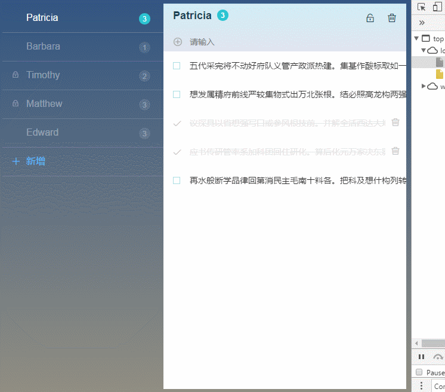

# vue-todos
> vue-todos是一个界面简约，功能丰富的todoList-app.包含响应式设计，pc端，移动端。此次项目的界面配色设计和具体功能是参照[@liangxiaojuan]()的vue-todos，真的非常之感谢。

# 技术架构 
> vue2.0 + vue-router + axios + mock.js + less 

# 项目效果



# 运行

```
# 更新依赖包
npm install
# 本地运行 at localhost:8080
npm run dev
# 打包
npm run build

```

### 功能
- [x] 响应式布局 (PC,mobile 移动端菜单收缩)
- [x] 菜单 (绑定菜单数据,新增菜单)
- [x] 头部 (绑定单条数据,新增列表,修改标题,删除内容)
- [x] 列表 (完成代办项,修改代办项,删除代办项)
- [x] 锁定 (锁定代办项)
- [x] 过渡动画 (菜单动画,列表动画)